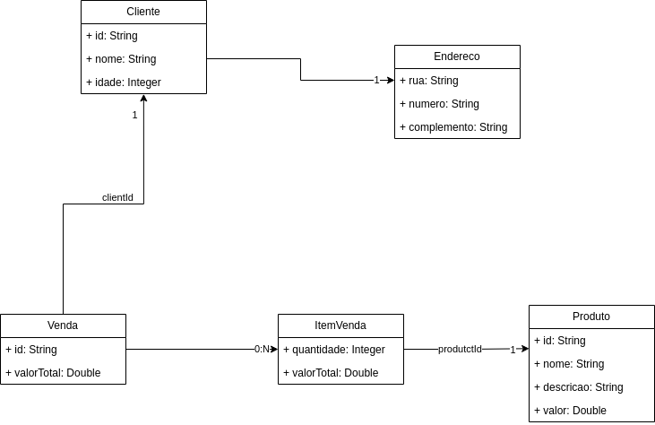

# Live Test Softdesign - Java / Spring

Este repositório contém o fonte de um projeto onde serão feitas perguntas e solicitadas alteração para avaliar o candidato.

Observar as tecnologias que serão avaliadas, ter os requisitos instalados antes do teste, o executar o docker-compose para ter todas as imagens baixadas na máquina.

## Tecnologias

* JDK 21
* Spring Web MVC
* Redis
* MongoDB
* Kafka

## Requisitos

* JDK 21
* Alguma IDE (Intellij ou Visual Code)
* Docker
* Docker Compose

## Construir e executar

### Construir artefato
Executar o comando abaixo para executar testes e gerar o jar executável do Spring boot:
```
 ./gradlew clean build
```

### Executar Docker Compose
Rodar o docker-compose para subir toda a infra e o serviço:
```
docker-compose up --build -d
```

### Mostrar logs do serviço
Rodar o comando abaixo para visualizar os logs do serviço:
```
docker logs -f softdesignlivetest
```

### Swagger
Abrir a seguinte URL no browser para visualizar o Swagger UI:
```
http://localhost:8089/swagger-ui/index.html#/
```

### Destruir o serviço
```
docker-compose down
```

## Projeto

Este projeto modela um simples sistema de venda de produtos para um cliente, possui o cadastro de cliente e produtos,
possui também a venda para um cliente que possui os produtos da venda com suas quantidades e valores totais.

Abaixo segue um diagrama de classes com as classes usadas no projeto:



### Descrição de cada classe

* <b>Cliente</b>: Representa um cliente.
    * <b>id</b>: id do cliente.
    * <b>nome</b>: nome do cliente.
    * <b>idade</b>: idade do cliente.
    * <b>endereco</b>: sub documento contendo o endereço do cliente.
* <b>Endereço</b>: Representa um endereço de um cliente (é um sub documento de cliente)
    * <b>rua</b>: rua do endereço.
    * <b>numero</b>: número do endereo.
    * <b>complemento</b>: complemento do endereço.
* <b>Produto</b>: Representa um produto.
    * <b>id</b>: id do produto.
    * <b>nome</b>: nome do produto.
    * <b>descricao</b>: descrição do produto.
    * <b>valor</b>: valor do produto.
* <b>Venda</b>: Representa uma venda para um cliente.
    * <b>id</b>: id da venda.
    * <b>clienteId</b>: id do cliente para qual foi feita a venda.
    * <b>valorTotal</b>: valor total da venda (somatório de todos os valores de produtos com suas quantidades).
    * <b>items</b>: array que possui todos os produtos da venda com suas quantidades e valor total por produto.
* <b>ItemVenda</b>: Representa um item na venda, possui a quantidade, o produto, e o valor total por produto (é um array dentro da venda).
    * <b>produtoId</b>: id do produto deste item de venda.
    * <b>quantidade</b>: quantidade de produtos.
    * <b>valorTotal</b>: valor do produto multiplicado pela quantidade.

### Descição da API:

#### ClienteController

* ```@GetMapping("/clientes")```: retorna todos os clientes cadastrados.
* ```@GetMapping("/clientes/{id}")```: retorna um cliente usando o seu id.
* ```@PutMapping("/clientes/{id}")```: altera um cliente.
* ```@PostMapping("/clientes")```: cadastra um cliente.

#### ProdutosController

* ```@GetMapping("/produtos")```: retorna todos os produtos cadastrados.
* ```@GetMapping("/produtos/{id}")```: retorna um produto usando o seu id.
* ```@PutMapping("/produtos/{id}")```: altera um produto.
* ```@PostMapping("/produtos")```: cadastra um produto.

#### VendasController

* ```@GetMapping("/vendas")```: retorna todas as vendas.
* ```@GetMapping("/vendas/{id}")```: retorna uma venda usando o seu id.
* ```@PostMapping("/vendas")```: cadastra uma venda para um cliente.
* ```@PostMapping("/vendas/{id}/item")```: adiciona um item a venda contendo o id do produto e a quantidade do produto.
